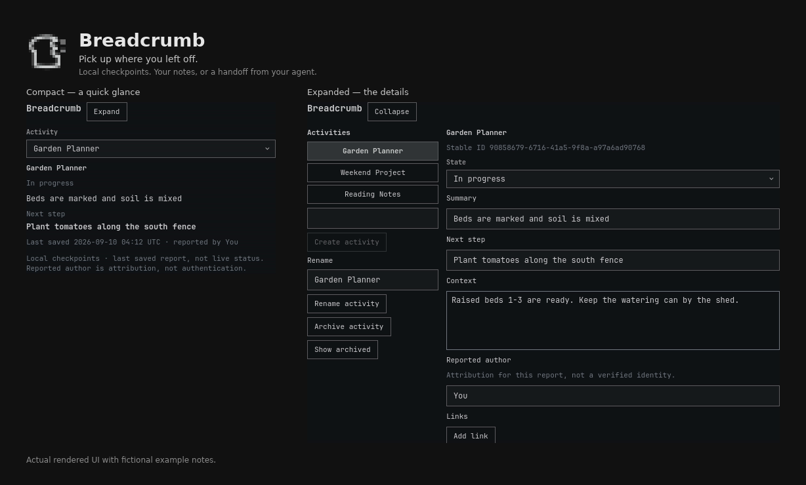

# Breadcrumb

A save point for your work — an Omarchy plugin for named activity checkpoints, written by you or your agent.



*Actual rendered UI, composed side by side. [Image provenance](docs/PREVIEW.md).*

Click the bread icon on the bar to see where you left off: status, next step, and optional context and links. Save a checkpoint when you mean it. An optional local command lets an existing agent leave the same kind of handoff.

License: MIT. Copyright (c) 2026 tbassss. See [LICENSE](LICENSE).

Parts of this plugin were written with AI assistance. Owner usability acceptance is not a code-security audit.

## Requirements

Tested on:

- Omarchy `4.0.3-1`
- Quickshell `0.3.1`
- Python 3 standard library only (`json`, `sqlite3`, `pathlib`, and similar). Live host Python was `3.14.7`.
- Qt `6.11.2` (Omarchy / Quickshell runtime)

No pip packages. Checkpoint storage is local SQLite. Opening a web, file, or folder link uses the desktop `xdg-open` helper on explicit click; `http`/`https` links may use the network. Breadcrumb does not ship a network listener, cloud account, or embedded AI. Optional SSH to the machine is your existing access, not a Breadcrumb service.

## Install

```bash
omarchy plugin add https://github.com/tbassss/omarchy-breadcrumb.git --enable
```

Plugin id: `tbassss.breadcrumb`. Official `omarchy plugin add` clones into `~/.config/omarchy/plugins/<id>/` and enables the widget when `--enable` is passed. Default bar section is `right`.

If the widget does not appear after enable, an Omarchy shell restart (`omarchy-restart-shell`) may be needed. That is a host action; Breadcrumb does not restart the shell itself.

Validate a local checkout with `omarchy plugin validate ./path-to-breadcrumb`.

## Usage

- **Compact** (default on first use): activity picker plus status, next step, timestamp, and reported author.
- **Expanded**: activity sidebar, context, links, editing, and history. Expand / Collapse keeps the selected activity and any unsaved draft. Compact shows the published checkpoint, not draft text.
- Create, rename, and switch activities. Each activity keeps its own history.
- **Archive** hides a finished activity without erasing checkpoints.
- **Unarchive** (Expanded, archived activity): one click, no confirmation. The same activity returns to the active list with its checkpoint, history, links, and draft. It does not append a checkpoint and is not history Restore.
- **Delete permanently** (Expanded, archived only): confirmation names that activity and warns that its checkpoints, history, links, and draft will be removed. Cancel leaves it unchanged. No bulk delete. Compact cannot show or complete delete.
- Typing keeps a **draft**. **Save checkpoint** publishes history. Closing the panel or restarting should not discard the draft. If an agent publishes while you are drafting, both survive until you resolve the conflict.

Links open only when you click Open. Web links must be `http`/`https`. File and folder links are absolute paths. Missing files show an error. Breadcrumb does not run embedded shell commands or arbitrary URL schemes.

## Optional agent command

Agents and scripts can list activities, read the current checkpoint, and publish a new one against a required expected revision. See [docs/COMMAND.md](docs/COMMAND.md).

```bash
python3 ~/.config/omarchy/plugins/tbassss.breadcrumb/bin/breadcrumb list
python3 ~/.config/omarchy/plugins/tbassss.breadcrumb/bin/breadcrumb read    < payload.json
python3 ~/.config/omarchy/plugins/tbassss.breadcrumb/bin/breadcrumb publish < payload.json
```

The command uses the same local store as the panel. It does not create, archive, unarchive, or delete activities. It does not start a server or queue. Author is a label you supply, not authentication.

It runs as your user and can read and write the local Breadcrumb database. It is not OS-sandboxed. Do not call `bin/breadcrumb-store`; that is the panel's internal seam.

If you already have SSH to the Omarchy host, feed JSON on stdin over that existing route so note text is not interpolated into remote argv. If the host is unreachable, the update is not delivered. Breadcrumb does not queue it.

## Remove and data

```bash
omarchy plugin disable tbassss.breadcrumb
omarchy plugin remove tbassss.breadcrumb --yes
```

Checkpoints and drafts live **outside** the plugin folder:

| Path | Contents |
|---|---|
| `${XDG_DATA_HOME:-$HOME/.local/share}/breadcrumb/breadcrumb.sqlite` | Activities, checkpoints, drafts, prefs |
| `BREADCRUMB_DATA_DIR` | Optional override used by tests |

Removing the plugin is intended to leave this directory in place. There is no automatic history expiration. Permanent delete of an archived activity is the only in-app erase of that activity's records.

Do not commit the database, real checkpoints, or personal screenshots.

## Local checks

```bash
PYTHONDONTWRITEBYTECODE=1 python3 -m unittest discover -s tests -v
python3 -m py_compile bin/breadcrumb-store bin/breadcrumb tests/*.py
git diff --check
```

## More

- [Changelog](CHANGELOG.md)
- [Product spec](docs/PRODUCT_SPEC.md)
- [Public command](docs/COMMAND.md)
- [Contributing](CONTRIBUTING.md)
- [Agent instructions](AGENTS.md)
